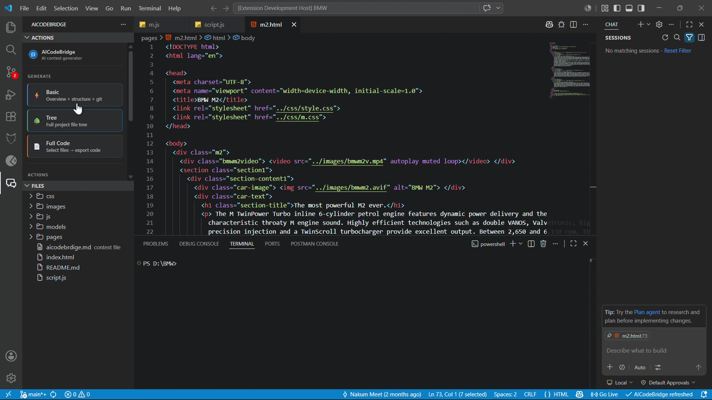

# aibridge — AICodeBridge
> 5/18/2026, 10:45:05 PM | 📄 Full

---

**aibridge** — TypeScript project.

## 🛠 Stack

- **Lang:** TypeScript
- **Tools:** TypeScript

## 🔧 Scripts

- `vscode:prepublish` → npm run compile
- `compile` → tsc -p ./
- `watch` → tsc -watch -p ./

## 📎 Code

### src/commands/askCopilot.ts _(77 lines)_
```typescript
import * as vscode from 'vscode';
import * as path from 'path';
import * as fs from 'fs';

export async function askCopilot(context: vscode.ExtensionContext): Promise<void> {
  // 1. Check workspace
  const folders = vscode.workspace.workspaceFolders;
  if (!folders?.length) {
    vscode.window.showErrorMessage('AICodeBridge: Open a project first.');
    return;
  }

  const root = folders[0].uri.fsPath;
  const config = vscode.workspace.getConfiguration('aicodebrdige');
  const fileName = config.get<string>('outputFileName') ?? 'aicodebrdige.md';
  const filePath = path.join(root, fileName);

  // 2. Ensure context file exists
  if (!fs.existsSync(filePath)) {
    const answer = await vscode.window.showWarningMessage(
      `AICodeBridge: No context file found (${fileName}). Generate one first.`,
      'Generate Basic',
      'Cancel'
    );
    if (answer === 'Generate Basic') {
      await vscode.commands.executeCommand('aicodebrdige.generateBasic');
      if (!fs.existsSync(filePath)) { return; }
    } else {
      return;
    }
  }

  // 3. Check Copilot Chat
  const copilotChatAvailable = vscode.extensions.getExtension('GitHub.copilot-chat');
  if (!copilotChatAvailable) {
    const action = await vscode.window.showWarningMessage(
      'GitHub Copilot Chat is not installed.',
      'Install Copilot Chat'
    );
    if (action === 'Install Copilot Chat') {
      vscode.commands.executeCommand('workbench.extensions.search', 'GitHub.copilot-chat');
    }
    return;
  }

  try {
    const fileUri = vscode.Uri.file(filePath);

    // Try official chat attach API first (VS Code 1.90+)
    try {
      await vscode.commands.executeCommand('workbench.action.chat.open', {
        attachFiles: [fileUri],
      });
      return;
    } catch { /* try next */ }

    // Try with query using #file mention
    try {
      await vscode.commands.executeCommand('workbench.action.chat.open', {
        query: `#file:${fileName} `,
        isPartialQuery: true,
      });
      return;
    } catch { /* try next */ }

    // Final fallback — open file in editor + open chat
    const doc = await vscode.workspace.openTextDocument(fileUri);
    await vscode.window.showTextDocument(doc, vscode.ViewColumn.One);
    await new Promise(resolve => setTimeout(resolve, 500));
    await vscode.commands.executeCommand('workbench.action.chat.open');

  } catch (err) {
    vscode.window.showErrorMessage(
      `AICodeBridge: Failed to open Copilot Chat — ${String(err)}`
    );
  }
}
```

### src/commands/copyContext.ts _(63 lines)_
```typescript
import * as vscode from 'vscode';
import * as fs from 'fs';
import * as path from 'path';
import { flashStatusBar } from '../statusBar';

export async function copyContext(): Promise<void> {
  const workspaceFolders = vscode.workspace.workspaceFolders;
  if (!workspaceFolders?.length) {
    vscode.window.showErrorMessage('AICodeBridge: Please open a folder first.');
    return;
  }

  const rootPath = workspaceFolders[0].uri.fsPath;
  const config = vscode.workspace.getConfiguration('aicodebrdige');
  const outputFileName = config.get<string>('outputFileName') ?? 'aicodebrdige.md';
  const outputFilePath = path.join(rootPath, outputFileName);

  if (!fs.existsSync(outputFilePath)) {
    const answer = await vscode.window.showWarningMessage(
      `AICodeBridge: ${outputFileName} does not exist yet.`,
      'Generate Now',
      'Cancel'
    );

    if (answer === 'Generate Now') {
      await vscode.commands.executeCommand('aicodebrdige.generateBasic');
      if (!fs.existsSync(outputFilePath)) return;
    } else {
      return;
    }
  }

  let content: string;
  try {
    content = fs.readFileSync(outputFilePath, 'utf-8');
  } catch (err) {
    vscode.window.showErrorMessage(
      `AICodeBridge: Could not read ${outputFileName} — ${String(err)}`
    );
    return;
  }

  const clipboardContent = `Here is my project context:\n\n${content}\n\n---\n\nMy question: `;

  try {
    await vscode.env.clipboard.writeText(clipboardContent);
  } catch (err) {
    vscode.window.showErrorMessage(
      `AICodeBridge: Failed to copy to clipboard — ${String(err)}`
    );
    return;
  }

  flashStatusBar(
    '$(copy) Context copied!',
    'Project context copied to clipboard — paste into any AI tool',
    4000
  );

  vscode.window.showInformationMessage(
    '📋 AICodeBridge: Context copied! Paste into ChatGPT, Claude, Gemini, or any AI tool.'
  );
}
```

### src/commands/detecterrors.ts _(127 lines)_
```typescript
import * as vscode from 'vscode';
import * as fs from 'fs';
import * as path from 'path';
import { exec } from 'child_process';
import { promisify } from 'util';

const execAsync = promisify(exec);

interface DetectedError {
  file: string;
  line: number;
  message: string;
  severity: 'error' | 'warning';
}

function detectProjectType(root: string): string {
  if (fs.existsSync(path.join(root, 'pubspec.yaml'))) return 'flutter';
  if (fs.existsSync(path.join(root, 'requirements.txt')) || fs.existsSync(path.join(root, 'pyproject.toml'))) return 'python';
  if (fs.existsSync(path.join(root, 'pom.xml')) || fs.existsSync(path.join(root, 'build.gradle'))) return 'java';
  if (fs.existsSync(path.join(root, 'tsconfig.json'))) return 'typescript';
  if (fs.existsSync(path.join(root, 'package.json'))) return 'javascript';
  return 'unknown';
}

// Use VS Code's built-in diagnostics — works for ALL languages instantly
function getVSCodeErrors(root: string): DetectedError[] {
  const errors: DetectedError[] = [];
  for (const [uri, diags] of vscode.languages.getDiagnostics()) {
    if (!uri.fsPath.startsWith(root)) continue;
    for (const d of diags) {
      if (d.severity !== vscode.DiagnosticSeverity.Error && d.severity !== vscode.DiagnosticSeverity.Warning) continue;
      errors.push({
        file: path.relative(root, uri.fsPath).replace(/\\/g, '/'),
        line: d.range.start.line + 1,
        message: d.message,
        severity: d.severity === vscode.DiagnosticSeverity.Error ? 'error' : 'warning',
      });
      if (errors.length >= 20) return errors;
    }
  }
  return errors;
}

// Fallback CLI for TypeScript
async function runTsc(root: string): Promise<DetectedError[]> {
  try {
    await execAsync('npx tsc --noEmit', { cwd: root, timeout: 15000 });
    return [];
  } catch (e: any) {
    return (e.stdout || e.stderr || '').split('\n')
      .filter(Boolean)
      .slice(0, 20)
      .map((l: string) => {
        const m = l.match(/(.+)\((\d+),\d+\):\s+(error|warning)\s+\w+:\s+(.+)/);
        return m
          ? { file: m[1].trim(), line: Number(m[2]), message: m[4].trim(), severity: m[3] as 'error' | 'warning' }
          : { file: 'unknown', line: 0, message: l.trim(), severity: 'error' as const };
      })
      .filter((e: DetectedError) => e.message.length > 0);
  }
}

export async function detectErrors(): Promise<void> {
  const folders = vscode.workspace.workspaceFolders;
  if (!folders?.length) {
    vscode.window.showErrorMessage('AICodeBridge: Open a project first.');
    return;
  }

  const root = folders[0].uri.fsPath;
  const config = vscode.workspace.getConfiguration('aicodebrdige');
  const fileName = config.get<string>('outputFileName') ?? 'aicodebrdige.md';
  const outPath = path.join(root, fileName);

  await vscode.window.withProgress(
    { location: vscode.ProgressLocation.Notification, title: 'AICodeBridge — Detecting errors...', cancellable: false },
    async (progress) => {
      progress.report({ message: 'Scanning...', increment: 30 });

      const projectType = detectProjectType(root);
      let errors = getVSCodeErrors(root);

      // Fallback to CLI if VS Code diagnostics empty
      if (!errors.length && projectType === 'typescript') {
        progress.report({ message: 'Running tsc...', increment: 40 });
        errors = await runTsc(root);
      }

      progress.report({ message: 'Writing results...', increment: 20 });

      const lines: string[] = ['\n\n---\n\n## 🐛 Errors\n'];
      lines.push(`> Scanned: ${new Date().toLocaleString()} | Type: ${projectType}\n`);

      if (!errors.length) {
        lines.push('✅ No errors found!\n');
      } else {
        lines.push(`**${errors.length} issue(s) found:**\n`);
        lines.push('| File | Line | Type | Message |');
        lines.push('|------|------|------|---------|');
        for (const e of errors) {
          lines.push(`| \`${e.file}\` | ${e.line || '-'} | ${e.severity === 'error' ? '❌' : '⚠️'} | ${e.message} |`);
        }
        lines.push('\n> Paste this file into ChatGPT/Claude to fix errors.\n');
      }

      // Append to context file
      if (fs.existsSync(outPath)) {
        let existing = fs.readFileSync(outPath, 'utf-8');
        existing = existing.replace(/\n\n---\n\n## 🐛 Errors[\s\S]*$/, '');
        fs.writeFileSync(outPath, existing + lines.join('\n'), 'utf-8');
      } else {
        fs.writeFileSync(outPath, lines.join('\n'), 'utf-8');
      }

      progress.report({ message: 'Done!', increment: 10 });

      const action = await vscode.window.showInformationMessage(
        errors.length ? `🐛 Found ${errors.length} error(s) — added to context file!` : '✅ No errors found!',
        errors.length ? 'Send to AI' : 'OK'
      );

      if (action === 'Send to AI') {
        vscode.commands.executeCommand('aicodebrdige.askCopilot');
      }
    }
  );
}
```

### src/commands/generateContext.ts _(176 lines)_
```typescript
import * as vscode from 'vscode';
import * as fs from 'fs';
import * as path from 'path';
import { scanWorkspace } from '../utils/folderScanner';
import { detectTechStack, getProjectName } from '../utils/techDetector';
import { getGitHistory } from '../utils/gitHelper';
import { buildMarkdown, GenerateMode } from '../utils/markdownBuilder';
import { flashStatusBar } from '../statusBar';

// ─── Error section helpers ────────────────────────────────────────────────────

interface DetectedError {
  file: string;
  line: number;
  message: string;
  severity: 'error' | 'warning';
}

function getVSCodeErrors(root: string): DetectedError[] {
  const errors: DetectedError[] = [];
  for (const [uri, diags] of vscode.languages.getDiagnostics()) {
    if (!uri.fsPath.startsWith(root)) continue;
    for (const d of diags) {
      if (
        d.severity !== vscode.DiagnosticSeverity.Error &&
        d.severity !== vscode.DiagnosticSeverity.Warning
      ) continue;
      errors.push({
        file: path.relative(root, uri.fsPath).replace(/\\/g, '/'),
        line: d.range.start.line + 1,
        message: d.message,
        severity: d.severity === vscode.DiagnosticSeverity.Error ? 'error' : 'warning',
      });
      if (errors.length >= 20) return errors;
    }
  }
  return errors;
}

function buildErrorSection(root: string): string {
  const errors = getVSCodeErrors(root);
  const lines: string[] = ['\n\n---\n\n## 🐛 Errors\n'];
  lines.push(`> Auto-scanned: ${new Date().toLocaleString()}\n`);

  if (!errors.length) {
    lines.push('✅ No errors found!\n');
  } else {
    lines.push(`**${errors.length} issue(s) found:**\n`);
    lines.push('| File | Line | Type | Message |');
    lines.push('|------|------|------|---------|');
    for (const e of errors) {
      lines.push(
        `| \`${e.file}\` | ${e.line || '-'} | ${e.severity === 'error' ? '❌' : '⚠️'} | ${e.message} |`
      );
    }
    lines.push('\n> Paste this file into ChatGPT/Claude to fix errors.\n');
  }

  return lines.join('\n');
}

// Strip existing error section from markdown string
function stripErrorSection(md: string): string {
  return md.replace(/\n\n---\n\n## 🐛 Errors[\s\S]*$/, '');
}

// ─── Main ─────────────────────────────────────────────────────────────────────

export async function generateContext(
  selectedFiles: string[] = [],
  mode: GenerateMode = 'basic'
): Promise<void> {

  try {
    const root = vscode.workspace.workspaceFolders?.[0]?.uri.fsPath;

    if (!root) {
      vscode.window.showErrorMessage('AICodeBridge: Please open a folder first.');
      return;
    }

    const cfg = vscode.workspace.getConfiguration('aicodebrdige');
    const outFileName = cfg.get<string>('outputFileName') ?? 'aicodebrdige.md';
    const outFile = path.join(root, outFileName);
    const autoOpen = cfg.get<boolean>('autoOpenAfterGenerate') ?? true;

    if (mode === 'basic' || mode === 'tree') {
      selectedFiles = [];
    }

    await vscode.window.withProgress(
      {
        location: vscode.ProgressLocation.Notification,
        title: `AICodeBridge — Generating ${mode}...`,
        cancellable: false,
      },
      async (progress) => {

        progress.report({ message: 'Scanning workspace...', increment: 20 });
        const scan = scanWorkspace(root);

        if (scan.totalFileCount > 10000) {
          const ans = await vscode.window.showWarningMessage(
            `AICodeBridge: ${scan.totalFileCount.toLocaleString()} files found. Continue?`,
            'Continue',
            'Cancel'
          );
          if (ans !== 'Continue') return;
        }

        progress.report({ message: 'Detecting tech stack...', increment: 20 });
        const techStack = detectTechStack(root);

        progress.report({ message: 'Reading git history...', increment: 20 });
        const includeGit = cfg.get<boolean>('includeGitHistory') ?? true;
        const gitCommits = includeGit ? await getGitHistory(root) : [];

        progress.report({ message: `Building ${mode} output...`, increment: 20 });

        // Build fresh markdown (no error section)
        let md = buildMarkdown({
          projectName: getProjectName(root),
          rootPath: root,
          techStack,
          tree: scan.tree,
          keyFiles: scan.keyFiles,
          gitCommits,
          selectedFiles,
          treeFlat: scan.allFiles,
          mode,
        });

        // Strip any leftover error section from buildMarkdown output (safety)
        md = stripErrorSection(md);

        // Always append fresh error section at the bottom
        progress.report({ message: 'Scanning errors...', increment: 10 });
        md = md + buildErrorSection(root);

        await fs.promises.writeFile(outFile, md, 'utf-8');

        progress.report({ message: 'Done!', increment: 10 });

        if (autoOpen) {
          const doc = await vscode.workspace.openTextDocument(outFile);
          await vscode.window.showTextDocument(doc);
        }

        const modeNames: Record<GenerateMode, string> = {
          basic: 'Basic',
          tree: 'Project Tree',
          full: 'Full Code',
        };

        flashStatusBar(
          '$(check) AICodeBridge generated',
          `${outFileName} ready (${modeNames[mode]} mode)`,
          4000
        );

        vscode.window.showInformationMessage(
          `✅ AICodeBridge: Generated in ${modeNames[mode]} mode` +
          (mode === 'full' && selectedFiles.length > 0
            ? ` — ${selectedFiles.length} file(s)`
            : '')
        );
      }
    );

  } catch (err: any) {
    console.error('AICodeBridge Error:', err);
    vscode.window.showErrorMessage(
      `❌ AICodeBridge failed: ${err?.message || 'Unknown error'}`
    );
  }
}
```

### src/commands/refreshContext.ts _(145 lines)_
```typescript
import * as vscode from 'vscode';
import * as path from 'path';
import * as fs from 'fs';
import { flashStatusBar } from '../statusBar';

// ─── Error section helpers ────────────────────────────────────────────────────

interface DetectedError {
  file: string;
  line: number;
  message: string;
  severity: 'error' | 'warning';
}

function getVSCodeErrors(root: string): DetectedError[] {
  const errors: DetectedError[] = [];

  for (const [uri, diags] of vscode.languages.getDiagnostics()) {
    if (!uri.fsPath.startsWith(root)) continue;

    for (const d of diags) {
      if (
        d.severity !== vscode.DiagnosticSeverity.Error &&
        d.severity !== vscode.DiagnosticSeverity.Warning
      ) {
        continue;
      }

      errors.push({
        file: path.relative(root, uri.fsPath).replace(/\\/g, '/'),
        line: d.range.start.line + 1,
        message: d.message,
        severity:
          d.severity === vscode.DiagnosticSeverity.Error
            ? 'error'
            : 'warning',
      });

      if (errors.length >= 20) return errors;
    }
  }

  return errors;
}

function buildErrorSection(root: string): string {
  const errors = getVSCodeErrors(root);

  const lines: string[] = ['\n\n---\n\n## 🐛 Errors\n'];

  lines.push(`> Auto-scanned: ${new Date().toLocaleString()}\n`);

  if (!errors.length) {
    lines.push('✅ No errors found!\n');
  } else {
    lines.push(`**${errors.length} issue(s) found:**\n`);
    lines.push('| File | Line | Type | Message |');
    lines.push('|------|------|------|---------|');

    for (const e of errors) {
      lines.push(
        `| \`${e.file}\` | ${e.line || '-'} | ${e.severity === 'error' ? '❌' : '⚠️'
        } | ${e.message} |`
      );
    }

    lines.push('\n> Paste this file into ChatGPT/Claude to fix errors.\n');
  }

  return lines.join('\n');
}

function stripErrorSection(md: string): string {
  return md.replace(/\n\n---\n\n## 🐛 Errors[\s\S]*$/, '');
}

// ─── Main ─────────────────────────────────────────────────────────────────────

export async function refreshContext(): Promise<void> {
  const workspaceFolders = vscode.workspace.workspaceFolders;

  if (!workspaceFolders || workspaceFolders.length === 0) {
    vscode.window.showErrorMessage(
      'AICodeBridge: No folder open. Open a project first.'
    );
    return;
  }

  const rootUri = workspaceFolders[0].uri;
  const rootPath = rootUri.fsPath;

  const config = vscode.workspace.getConfiguration('aicodebrdige');

  const outputFileName =
    config.get<string>('outputFileName') ?? 'aicodebrdige.md';

  const outputFilePath = path.join(rootPath, outputFileName);

  try {
    if (!fs.existsSync(outputFilePath)) {
      vscode.window.showWarningMessage(
        'AICodeBridge: Generate context first.'
      );
      return;
    }

    // Read existing generated file
    let markdown = fs.readFileSync(outputFilePath, 'utf-8');

    // Remove old error section only
    markdown = stripErrorSection(markdown);

    // Append fresh errors
    markdown += buildErrorSection(rootPath);

    await fs.promises.writeFile(
      outputFilePath,
      markdown,
      'utf-8'
    );

    flashStatusBar(
      '$(check) AICodeBridge refreshed',
      `${outputFileName} updated`,
      3000
    );

    vscode.window.showInformationMessage(
      `✅ AICodeBridge: ${outputFileName} refreshed.`
    );

  } catch (err) {
    console.error('AICodeBridge: Refresh failed:', err);

    flashStatusBar(
      '$(warning) AICodeBridge failed',
      String(err),
      4000
    );

    vscode.window.showErrorMessage(
      'AICodeBridge: Failed to refresh context. Check logs.'
    );
  }
}
```

### src/commands/showDiff.ts _(100 lines)_
```typescript
import * as vscode from 'vscode';
import * as fs from 'fs';
import * as path from 'path';
import { scanWorkspace } from '../utils/folderScanner';
import { getProjectName } from '../utils/techDetector';

let channel: vscode.OutputChannel | null = null;

function getChannel(): vscode.OutputChannel {
  if (!channel) {
    channel = vscode.window.createOutputChannel('AICodeBridge Diff');
  }
  return channel;
}

export async function showDiff(): Promise<void> {
  const ws = vscode.workspace.workspaceFolders;
  if (!ws?.length) {
    vscode.window.showErrorMessage('AICodeBridge: Open a project first.');
    return;
  }

  const root = ws[0].uri.fsPath;
  const config = vscode.workspace.getConfiguration('aicodebrdige');
  const fileName = config.get<string>('outputFileName') ?? 'aicodebrdige.md';
  const filePath = path.join(root, fileName);

  if (!fs.existsSync(filePath)) {
    vscode.window.showWarningMessage('AICodeBridge: Generate context first.');
    return;
  }

  const ch = getChannel();
  ch.clear();
  ch.show(true);

  const oldContent = fs.readFileSync(filePath, 'utf-8');

  // FIX 3: extract full relative paths (e.g. "src/index.ts") from the tree,
  // not just basenames — avoids false matches when two folders have same-named files.
  const oldFiles = new Set<string>();
  for (const line of oldContent.split('\n')) {
    // Match tree connector lines: ├── or └── with optional leading │/space chars
    const m = line.match(/[├└]── (.+?)\/?\s*$/);
    if (!m) continue;
    const name = m[1].trim();
    if (name === '...') continue;           // depth-truncation placeholder
    if (name.endsWith('/')) continue;       // directory — skip
    oldFiles.add(name);
  }

  const scan = scanWorkspace(root);

  // Build a map of basename → full relative paths so we can do accurate matching
  const currentByBasename = new Map<string, string[]>();
  for (const absPath of scan.allFiles) {
    const rel = path.relative(root, absPath).replace(/\\/g, '/');
    const base = path.basename(rel);
    if (!currentByBasename.has(base)) currentByBasename.set(base, []);
    currentByBasename.get(base)!.push(rel);
  }

  const currentFiles = new Set(
    scan.allFiles.map(f => path.relative(root, f).replace(/\\/g, '/'))
  );

  const newFiles: string[] = [];
  const deletedFiles: string[] = [];

  // Files in current workspace not recorded in old snapshot
  for (const rel of currentFiles) {
    const base = path.basename(rel);
    if (!oldFiles.has(base)) newFiles.push(rel);
  }

  // Files in old snapshot no longer present in current workspace
  for (const base of oldFiles) {
    const matches = currentByBasename.get(base);
    if (!matches || matches.length === 0) deletedFiles.push(base);
  }

  ch.appendLine('==== AICODEBRDIGE DIFF ====');
  ch.appendLine(`Project: ${getProjectName(root)}\n`);

  if (newFiles.length) {
    ch.appendLine('NEW FILES:');
    newFiles.slice(0, 50).forEach(f => ch.appendLine(`+ ${f}`));
    ch.appendLine('');
  }

  if (deletedFiles.length) {
    ch.appendLine('DELETED FILES:');
    deletedFiles.slice(0, 50).forEach(f => ch.appendLine(`- ${f}`));
    ch.appendLine('');
  }

  if (!newFiles.length && !deletedFiles.length) {
    ch.appendLine('No changes detected.');
  }
}
```

### src/providers/filePickerProvider.ts _(206 lines)_
```typescript
import * as vscode from 'vscode';
import * as fs from 'fs';
import * as path from 'path';
import { getIgnoredFolders, getMaxDepth } from '../utils/folderScanner';
import { isBinaryOrLockFile } from '../utils/markdownBuilder';

function getOutputFileName(): string {
  const config = vscode.workspace.getConfiguration('aicodebrdige');
  return config.get<string>('outputFileName') ?? 'aicodebrdige.md';
}

export class FileItem extends vscode.TreeItem {
  children: FileItem[] = [];
  isChecked = false;

  constructor(
    public readonly absolutePath: string,
    public readonly isDirectory: boolean,
    label: string,
    state: vscode.TreeItemCollapsibleState
  ) {
    super(label, state);
    this.command = isDirectory
      ? undefined
      : { command: 'aicodebrdige.toggleFile', title: 'Toggle', arguments: [this] };
    this.updateUI();
  }

  updateUI(): void {
    if (this.isDirectory) {
      this.iconPath = new vscode.ThemeIcon(this.isChecked ? 'folder-opened' : 'folder');
      this.description = this.isChecked ? '✓' : '';
    } else {
      this.iconPath = new vscode.ThemeIcon(this.isChecked ? 'check' : 'file');
      this.description = this.isChecked ? '✓' : '';
    }
    this.tooltip = this.isChecked
      ? `${this.label} — included in context`
      : `${this.label} — click to include`;
  }
}

export class FilePickerProvider implements vscode.TreeDataProvider<FileItem> {
  private _change = new vscode.EventEmitter<void>();
  readonly onDidChangeTreeData = this._change.event;

  private selected = new Set<string>();
  private roots: FileItem[] = [];

  constructor(private root: string) {}

  refresh(): void {
    this.roots = [];
    this._change.fire();
  }

  getTreeItem(e: FileItem): FileItem {
    return e;
  }

  getChildren(e?: FileItem): FileItem[] {
    if (!e) {
      if (!this.roots.length) {
        this.roots = this.build(this.root, 0);
      }
      return this.roots;
    }
    return e.children;
  }

  toggle(item: FileItem): void {
    if (item.isDirectory) {
      this.setDir(item, !item.isChecked);
    } else {
      item.isChecked = !item.isChecked;
      item.isChecked
        ? this.selected.add(item.absolutePath)
        : this.selected.delete(item.absolutePath);
      item.updateUI();
    }
    this._change.fire();
  }

  selectAll(): void {
    this.setAll(this.roots, true);
    this._change.fire();
  }

  deselectAll(): void {
    this.selected.clear();
    this.setAll(this.roots, false);
    this._change.fire();
  }

  getSelected(): string[] {
    return Array.from(this.selected).filter(p => {
      try { return fs.statSync(p).isFile(); } catch { return false; }
    });
  }

  getSelectedCount(): number {
    return this.selected.size;
  }

  private setDir(item: FileItem, checked: boolean): void {
    item.isChecked = checked;
    item.updateUI();
    for (const child of item.children) {
      if (child.isDirectory) {
        this.setDir(child, checked);
      } else {
        if (this.isBinaryInPicker(child.absolutePath)) continue;
        child.isChecked = checked;
        checked
          ? this.selected.add(child.absolutePath)
          : this.selected.delete(child.absolutePath);
        child.updateUI();
      }
    }
  }

  private setAll(items: FileItem[], checked: boolean): void {
    for (const item of items) {
      if (item.isDirectory) {
        item.isChecked = checked;
        item.updateUI();
        this.setAll(item.children, checked);
      } else {
        if (this.isBinaryInPicker(item.absolutePath)) continue;
        item.isChecked = checked;
        checked
          ? this.selected.add(item.absolutePath)
          : this.selected.delete(item.absolutePath);
        item.updateUI();
      }
    }
  }

  /**
   * Binary check for the file picker UI.
   * Unlike the context generator, we never hide the output .md file — it should
   * be visible in the tree (just not selectable for Full mode since it's auto-excluded
   * by markdownBuilder's IGNORE_FILES during generation).
   */
  private isBinaryInPicker(fp: string): boolean {
    const base = path.basename(fp);
    // Never mark the generated context file as binary — it's a plain text .md file.
    if (base === getOutputFileName()) return false;
    return isBinaryOrLockFile(fp);
  }

  private build(dir: string, depth: number): FileItem[] {
    if (depth > getMaxDepth()) return [];

    let entries: fs.Dirent[];
    try {
      entries = fs.readdirSync(dir, { withFileTypes: true });
    } catch {
      return [];
    }

    entries.sort((a, b) => {
      if (a.isDirectory() === b.isDirectory()) return a.name.localeCompare(b.name);
      return a.isDirectory() ? -1 : 1;
    });

    const items: FileItem[] = [];
    const outputFileName = getOutputFileName();

    for (const e of entries) {
      if (getIgnoredFolders().includes(e.name)) continue;
      if (e.name.startsWith('.') && e.name !== '.gitignore' && !e.name.startsWith('.env')) continue;

      const full = path.join(dir, e.name);

      if (e.isDirectory()) {
        const item = new FileItem(full, true, e.name, vscode.TreeItemCollapsibleState.Collapsed);
        item.children = this.build(full, depth + 1);
        items.push(item);
      } else {
        const item = new FileItem(full, false, e.name, vscode.TreeItemCollapsibleState.None);

        // The output md file: show it but mark as non-selectable
        if (e.name === outputFileName) {
          item.iconPath = new vscode.ThemeIcon('file-text');
          item.description = 'context file';
          item.tooltip = 'Generated context file — auto-excluded from Full mode';
          item.command = undefined;
          items.push(item);
          continue;
        }

        if (isBinaryOrLockFile(full)) {
          item.iconPath = new vscode.ThemeIcon('circle-slash');
          item.description = 'skipped — binary';
          item.tooltip = 'Binary or lock file — automatically skipped';
          item.command = undefined;
        }

        items.push(item);
      }
    }

    return items;
  }
}
```

### src/ui/SidebarPanelProvider.ts _(332 lines)_
```typescript
import * as vscode from 'vscode';

export class SidebarPanelProvider implements vscode.WebviewViewProvider {
  public static readonly viewType = 'aicodebridge-sidebar';

  constructor(private readonly context: vscode.ExtensionContext) {}

  resolveWebviewView(webviewView: vscode.WebviewView) {
    webviewView.webview.options = {
      enableScripts: true,
    };

    const iconUri = webviewView.webview.asWebviewUri(
      vscode.Uri.joinPath(
        this.context.extensionUri,
        'images',
        'icon.png'
      )
    );

    webviewView.webview.html = this.getHtml(iconUri);

    webviewView.webview.onDidReceiveMessage((msg) => {
      vscode.commands.executeCommand(`aicodebrdige.${msg.command}`);
    });
  }

  private getHtml(iconUri: vscode.Uri): string {
    return `<!DOCTYPE html>
<html lang="en">
<head>
  <meta charset="UTF-8" />
  <meta name="viewport" content="width=device-width, initial-scale=1.0" />
  <title>AICodeBridge</title>

  <style>
    *, *::before, *::after {
      box-sizing: border-box;
      margin: 0;
      padding: 0;
    }

    body {
      font-family: -apple-system, BlinkMacSystemFont, 'Segoe UI', sans-serif;
      background: transparent;
      color: var(--vscode-foreground);
      padding: 12px 10px 16px;
      display: flex;
      flex-direction: column;
      gap: 6px;
      min-height: 100vh;
    }

    /* Header */
    .header {
      display: flex;
      align-items: center;
      gap: 8px;
      padding: 0 2px 10px;
      border-bottom: 1px solid var(--vscode-widget-border, #333);
      margin-bottom: 4px;
    }

    .logo {
      width: 22px;
      height: 22px;
      object-fit: cover;
      border-radius: 5px;
      flex-shrink: 0;
    }

    .header-text {
      display: flex;
      flex-direction: column;
      gap: 1px;
    }

    .title {
      font-size: 11px;
      font-weight: 600;
      color: var(--vscode-foreground);
      letter-spacing: 0.02em;
    }

    .subtitle {
      font-size: 9px;
      color: var(--vscode-descriptionForeground);
      letter-spacing: 0.03em;
    }

    /* Section Label */
    .label {
      font-size: 9px;
      font-weight: 600;
      text-transform: uppercase;
      letter-spacing: 0.1em;
      color: var(--vscode-descriptionForeground);
      padding: 6px 2px 4px;
    }

    /* Buttons */
    .btn {
      display: flex;
      align-items: center;
      gap: 10px;
      width: 100%;
      padding: 9px 10px;
      background: var(--vscode-button-secondaryBackground, #2a2d2e);
      border: 1px solid var(--vscode-widget-border, #3c3c3c);
      border-radius: 6px;
      color: var(--vscode-foreground);
      font-family: inherit;
      font-size: 12px;
      font-weight: 500;
      cursor: pointer;
      text-align: left;
      transition: background 0.15s, border-color 0.15s;
      outline: none;
    }

    .btn:hover {
      background: var(--vscode-list-hoverBackground, #2a2d2e);
      border-color: var(--vscode-focusBorder, #007fd4);
    }

    .btn:active {
      opacity: 0.85;
    }

    .btn-icon {
      font-size: 14px;
      width: 20px;
      text-align: center;
      flex-shrink: 0;
    }

    .btn-info {
      display: flex;
      flex-direction: column;
      gap: 1px;
      flex: 1;
    }

    .btn-name {
      font-size: 12px;
      font-weight: 600;
      color: var(--vscode-foreground);
    }

    .btn-desc {
      font-size: 10px;
      color: var(--vscode-descriptionForeground);
    }

    .btn-basic   { border-left: 2px solid #4f8eff; }
    .btn-tree    { border-left: 2px solid #3ecf8e; }
    .btn-full    { border-left: 2px solid #f97316; }
    .btn-copy    { border-left: 2px solid #a855f7; }
    .btn-copilot { border-left: 2px solid #f5a623; }

    /* Divider */
    .divider {
      height: 1px;
      background: var(--vscode-widget-border, #333);
      margin: 6px 0;
    }

    /* Small buttons row */
    .row {
      display: flex;
      gap: 6px;
    }

    .btn-sm {
      flex: 1;
      display: flex;
      align-items: center;
      justify-content: center;
      gap: 5px;
      padding: 7px 6px;
      background: var(--vscode-button-secondaryBackground, #2a2d2e);
      border: 1px solid var(--vscode-widget-border, #3c3c3c);
      border-radius: 6px;
      color: var(--vscode-descriptionForeground);
      font-family: inherit;
      font-size: 10px;
      font-weight: 500;
      cursor: pointer;
      transition: background 0.15s, color 0.15s, border-color 0.15s;
      outline: none;
    }

    .btn-sm:hover {
      background: var(--vscode-list-hoverBackground);
      color: var(--vscode-foreground);
      border-color: var(--vscode-focusBorder, #007fd4);
    }

    /* Copilot badge */
    .copilot-badge {
      font-size: 9px;
      background: rgba(245, 166, 35, 0.15);
      color: #f5a623;
      border: 1px solid rgba(245, 166, 35, 0.3);
      border-radius: 3px;
      padding: 1px 5px;
      flex-shrink: 0;
      font-weight: 600;
      letter-spacing: 0.02em;
    }

    /* Status */
    .status {
      margin-top: auto;
      display: flex;
      align-items: center;
      gap: 6px;
      padding: 8px 10px;
      background: var(--vscode-button-secondaryBackground, #2a2d2e);
      border: 1px solid var(--vscode-widget-border, #3c3c3c);
      border-radius: 6px;
    }

    .dot {
      width: 5px;
      height: 5px;
      border-radius: 50%;
      background: #3ecf8e;
      flex-shrink: 0;
      animation: pulse 2.5s ease-in-out infinite;
    }

    @keyframes pulse {
      0%, 100% { opacity: 1; }
      50%       { opacity: 0.3; }
    }

    .status-text {
      font-size: 9px;
      color: var(--vscode-descriptionForeground);
    }
  </style>
</head>

<body>

  <!-- Header -->
  <div class="header">
    
    <div class="header-text">
      <span class="title">AICodeBridge</span>
      <span class="subtitle">AI context generator</span>
    </div>
  </div>

  <!-- Generate -->
  <div class="label">Generate</div>

  <button class="btn btn-basic" onclick="send('generateBasic')">
    <span class="btn-icon">⚡</span>
    <div class="btn-info">
      <span class="btn-name">Basic</span>
      <span class="btn-desc">Overview + structure + git</span>
    </div>
  </button>

  <button class="btn btn-tree" onclick="send('generateTree')">
    <span class="btn-icon">🌳</span>
    <div class="btn-info">
      <span class="btn-name">Tree</span>
      <span class="btn-desc">Full project file tree</span>
    </div>
  </button>

  <button class="btn btn-full" onclick="send('generateFull')">
    <span class="btn-icon">📄</span>
    <div class="btn-info">
      <span class="btn-name">Full Code</span>
      <span class="btn-desc">Select files → export code</span>
    </div>
  </button>

  <div class="divider"></div>

  <!-- Actions -->
  <div class="label">Actions</div>

  <!-- Copy Context -->
  <button class="btn btn-copy" onclick="send('copy')">
    <span class="btn-icon">📋</span>
    <div class="btn-info">
      <span class="btn-name">Copy Context</span>
      <span class="btn-desc">Copy to clipboard — paste into any AI</span>
    </div>
  </button>

  <!-- Ask Copilot -->
  <button class="btn btn-copilot" onclick="send('askCopilot')">
    <span class="btn-icon">🤖</span>
    <div class="btn-info">
      <span class="btn-name">Ask Copilot</span>
      <span class="btn-desc">Ask a question — answers in VS Code</span>
    </div>
    <span class="copilot-badge">Copilot</span>
  </button>

  <!-- Utility row -->
  <div class="row">
    <button class="btn-sm" onclick="send('refresh')">
      🔄 Refresh
    </button>
    
  </div>

  <!-- Status -->
  <div class="status">
    <div class="dot"></div>
    <span class="status-text">ready · aicodebrdige.md</span>
  </div>

  <script>
    const vscode = acquireVsCodeApi();

    function send(cmd) {
      vscode.postMessage({ command: cmd });
    }
  </script>

</body>
</html>`;
  }
}
```

### src/ui/webviewPanel.ts _(72 lines)_
```typescript
import * as vscode from 'vscode';

export function openAICodeBridgePanel(context: vscode.ExtensionContext) {
  const panel = vscode.window.createWebviewPanel(
    'aicodebridge-panel',
    'AICodeBridge',
    vscode.ViewColumn.One,
    { enableScripts: true }
  );

  panel.webview.html = getHtml();

  panel.webview.onDidReceiveMessage(async (msg) => {
    switch (msg.command) {
      case 'basic':
        vscode.commands.executeCommand('aicodebrdige.generateBasic');
        break;
      case 'tree':
        vscode.commands.executeCommand('aicodebrdige.generateTree');
        break;
      case 'full':
        vscode.commands.executeCommand('aicodebrdige.generateFull');
        break;
    }
  });
}

function getHtml(): string {
  return `
  <!DOCTYPE html>
  <html>
  <head>
    <style>
      body {
        font-family: sans-serif;
        padding: 20px;
        background: #1e1e1e;
        color: white;
      }
      button {
        width: 100%;
        padding: 20px;
        margin: 10px 0;
        font-size: 18px;
        border: none;
        border-radius: 8px;
        cursor: pointer;
      }
      .basic { background: #007acc; }
      .tree { background: #388a34; }
      .full { background: #a31515; }
    </style>
  </head>
  <body>

    <h2>AICodeBridge</h2>

    <button class="basic" onclick="send('basic')">⚡ Generate Basic</button>
    <button class="tree" onclick="send('tree')">🌳 Generate Tree</button>
    <button class="full" onclick="send('full')">📄 Generate Full</button>

    <script>
      const vscode = acquireVsCodeApi();
      function send(cmd) {
        vscode.postMessage({ command: cmd });
      }
    </script>

  </body>
  </html>
  `;
}
```

### src/utils/fileWatcher.ts _(146 lines)_
```typescript
import * as vscode from 'vscode';
import * as path from 'path';
import * as fs from 'fs';

let debounceTimer: ReturnType<typeof setTimeout> | null = null;

// ─── Error detection (inline — no button needed) ─────────────────────────────

interface DetectedError {
  file: string;
  line: number;
  message: string;
  severity: 'error' | 'warning';
}

function getVSCodeErrors(root: string): DetectedError[] {
  const errors: DetectedError[] = [];
  for (const [uri, diags] of vscode.languages.getDiagnostics()) {
    if (!uri.fsPath.startsWith(root)) continue;
    for (const d of diags) {
      if (
        d.severity !== vscode.DiagnosticSeverity.Error &&
        d.severity !== vscode.DiagnosticSeverity.Warning
      ) continue;
      errors.push({
        file: path.relative(root, uri.fsPath).replace(/\\/g, '/'),
        line: d.range.start.line + 1,
        message: d.message,
        severity: d.severity === vscode.DiagnosticSeverity.Error ? 'error' : 'warning',
      });
      if (errors.length >= 20) return errors;
    }
  }
  return errors;
}

function buildErrorSection(errors: DetectedError[]): string {
  const lines: string[] = ['\n\n---\n\n## 🐛 Errors\n'];
  lines.push(`> Auto-scanned: ${new Date().toLocaleString()}\n`);

  if (!errors.length) {
    lines.push('✅ No errors found!\n');
  } else {
    lines.push(`**${errors.length} issue(s) found:**\n`);
    lines.push('| File | Line | Type | Message |');
    lines.push('|------|------|------|---------|');
    for (const e of errors) {
      lines.push(
        `| \`${e.file}\` | ${e.line || '-'} | ${e.severity === 'error' ? '❌' : '⚠️'} | ${e.message} |`
      );
    }
    lines.push('\n> Paste this file into ChatGPT/Claude to fix errors.\n');
  }

  return lines.join('\n');
}

function appendErrorsToFile(outPath: string, root: string): void {
  if (!fs.existsSync(outPath)) return;

  const errors = getVSCodeErrors(root);
  const section = buildErrorSection(errors);

  let existing = fs.readFileSync(outPath, 'utf-8');
  // Remove any previous error section before appending fresh one
  existing = existing.replace(/\n\n---\n\n## 🐛 Errors[\s\S]*$/, '');
  fs.writeFileSync(outPath, existing + section, 'utf-8');
}

// ─── Status bar helpers ───────────────────────────────────────────────────────

function showUpdateMessage(statusBar: vscode.StatusBarItem, fileName: string): void {
  const originalText = statusBar.text;
  const originalTooltip = statusBar.tooltip;

  statusBar.text = '$(sync~spin) AICodeBridge updating...';
  statusBar.tooltip = `Regenerating ${fileName}...`;

  setTimeout(() => {
    statusBar.text = '$(check) AICodeBridge updated';
    statusBar.tooltip = `${fileName} was regenerated`;

    setTimeout(() => {
      statusBar.text = originalText;
      statusBar.tooltip =
        originalTooltip instanceof vscode.MarkdownString
          ? originalTooltip
          : originalTooltip ?? 'Open AICodeBridge panel';
    }, 3000);
  }, 1500);
}

// ─── Main watcher ─────────────────────────────────────────────────────────────

export function registerFileWatcher(
  context: vscode.ExtensionContext,
  statusBar: vscode.StatusBarItem,
  onRefresh: () => Promise<void>
): vscode.Disposable {

  const disposable = vscode.workspace.onDidSaveTextDocument(async (doc) => {
    const config = vscode.workspace.getConfiguration('aicodebrdige');
    const autoRefresh = config.get<boolean>('autoRefreshOnSave') ?? false;

    const workspaceFolders = vscode.workspace.workspaceFolders;
    if (!workspaceFolders?.length) return;

    const rootPath = workspaceFolders[0].uri.fsPath;
    const outputFileName = config.get<string>('outputFileName') ?? 'aicodebrdige.md';
    const outputFilePath = path.join(rootPath, outputFileName);

    // Never watch the output file itself
    if (doc.uri.fsPath === outputFilePath) return;
    if (!fs.existsSync(outputFilePath)) return;

    if (debounceTimer) clearTimeout(debounceTimer);

    debounceTimer = setTimeout(async () => {
      debounceTimer = null;

      try {
        // Refresh context if enabled
        if (autoRefresh) {
          await onRefresh();
          showUpdateMessage(statusBar, outputFileName);
        }

        // Always append fresh error section after any file save
        appendErrorsToFile(outputFilePath, rootPath);

      } catch {
        // Silent failure — auto features should never interrupt the developer
      }
    }, 2000);
  });

  context.subscriptions.push(disposable);
  return disposable;
}

export function disposeFileWatcher(): void {
  if (debounceTimer) {
    clearTimeout(debounceTimer);
    debounceTimer = null;
  }
}
```

### src/utils/folderScanner.ts _(136 lines)_
```typescript
import * as fs from 'fs';
import * as path from 'path';
import * as vscode from 'vscode';

export interface FolderNode {
  name: string;
  isDirectory: boolean;
  children?: FolderNode[];
  relativePath: string;
}

export interface ScanResult {
  tree: FolderNode[];
  allFiles: string[];
  keyFiles: string[];
  totalFileCount: number;
}

const KEY_FILES = new Set([
  'package.json', 'tsconfig.json', 'Dockerfile',
  'docker-compose.yml', 'README.md', '.gitignore'
]);

const SKIP_EXTENSIONS = new Set([
  '.png', '.jpg', '.jpeg', '.gif', '.svg',
  '.mp4', '.mp3', '.zip', '.exe'
]);

export function getIgnoredFolders(): string[] {
  const config = vscode.workspace.getConfiguration('aicodebrdige');
  return config.get<string[]>('ignoredFolders') ?? [
    'node_modules', '.git', 'dist', 'build', '.next', 'out'
  ];
}

export function getMaxDepth(): number {
  const config = vscode.workspace.getConfiguration('aicodebrdige');
  return config.get<number>('maxDepth') ?? 4;
}

export function scanWorkspace(rootPath: string): ScanResult {
  const ignoredFolders = getIgnoredFolders();
  const maxDepth = getMaxDepth();

  const allFiles: string[] = [];
  const keyFiles: string[] = [];
  let totalFileCount = 0;

  function buildTree(dir: string, depth: number): FolderNode[] {
    if (depth > maxDepth) {
      return [{
        name: '...',
        isDirectory: true,
        relativePath: ''
      }];
    }

    let entries: fs.Dirent[];
    try {
      entries = fs.readdirSync(dir, { withFileTypes: true });
    } catch {
      return [];
    }

    entries.sort((a, b) => {
      if (a.isDirectory() && !b.isDirectory()) return -1;
      if (!a.isDirectory() && b.isDirectory()) return 1;
      return a.name.localeCompare(b.name);
    });

    const nodes: FolderNode[] = [];

    for (const entry of entries) {
      if (ignoredFolders.includes(entry.name)) continue;

      const full = path.join(dir, entry.name);
      const rel = path.relative(rootPath, full).replace(/\\/g, '/');

      if (entry.name.startsWith('.') && !KEY_FILES.has(entry.name)) continue;

      if (entry.isDirectory()) {
        nodes.push({
          name: entry.name,
          isDirectory: true,
          children: buildTree(full, depth + 1),
          relativePath: rel
        });
      } else {
        const ext = path.extname(entry.name).toLowerCase();
        if (SKIP_EXTENSIONS.has(ext)) continue;

        totalFileCount++;
        allFiles.push(full);

        if (KEY_FILES.has(entry.name)) {
          keyFiles.push(rel);
        }

        nodes.push({
          name: entry.name,
          isDirectory: false,
          relativePath: rel
        });
      }
    }

    return nodes;
  }

  return {
    tree: buildTree(rootPath, 0),
    allFiles,
    keyFiles,
    totalFileCount
  };
}

export function renderTree(nodes: FolderNode[], prefix = ''): string {
  let result = '';

  for (let i = 0; i < nodes.length; i++) {
    const node = nodes[i];
    const isLast = i === nodes.length - 1;

    const connector = isLast ? '└── ' : '├── ';
    const nextPrefix = prefix + (isLast ? '    ' : '│   ');

    result += `${prefix}${connector}${node.name}${node.isDirectory ? '/' : ''}\n`;

    if (node.isDirectory && node.children) {
      result += renderTree(node.children, nextPrefix);
    }
  }

  return result;
}
```

### src/utils/gitHelper.ts _(127 lines)_
```typescript
import * as fs from 'fs';
import * as path from 'path';
import { exec } from 'child_process';
import * as vscode from 'vscode';
import { promisify } from 'util';

const execAsync = promisify(exec);

export interface GitCommit {
  hash: string;
  author: string;
  relativeDate: string;
  message: string;
}

/** Check if git repo exists */
export function hasGitRepo(rootPath: string): boolean {
  return fs.existsSync(path.join(rootPath, '.git'));
}

/** Get git history (async + safe) */
export async function getGitHistory(
  rootPath: string,
  count?: number
): Promise<GitCommit[]> {

  if (!hasGitRepo(rootPath)) return [];

  const config = vscode.workspace.getConfiguration('aicodebrdige');
  const logCount = count ?? config.get<number>('gitLogCount') ?? 10;

  try {
    const format = '%h|%an|%ar|%s';
    const command = `git log --pretty=format:"${format}" -${logCount}`;

    const { stdout } = await execAsync(command, {
      cwd: rootPath,
      timeout: 5000
    });

    return stdout
      .split('\n')
      .filter(Boolean)
      .map(line => {
        const [hash, author, relativeDate, ...msg] = line.split('|');
        return {
          hash: hash?.trim(),
          author: author?.trim(),
          relativeDate: relativeDate?.trim(),
          message: msg.join('|').trim()
        };
      });

  } catch {
    return [];
  }
}

/** Get current branch */
export async function getCurrentBranch(rootPath: string): Promise<string | null> {
  if (!hasGitRepo(rootPath)) return null;

  try {
    const { stdout } = await execAsync(
      'git rev-parse --abbrev-ref HEAD',
      { cwd: rootPath }
    );
    return stdout.trim();
  } catch {
    return null;
  }
}

/** Get changed files */
export async function getGitStatus(
  rootPath: string
): Promise<Array<{ status: string; file: string }>> {

  if (!hasGitRepo(rootPath)) return [];

  try {
    const { stdout } = await execAsync(
      'git status --porcelain',
      { cwd: rootPath }
    );

    return stdout
      .split('\n')
      .filter(Boolean)
      .map(line => ({
        status: line.slice(0, 2).trim(),
        file: line.slice(3).trim()
      }));

  } catch {
    return [];
  }
}

/** 🔥 NEW: Analyze commits for insights */
export function analyzeGitCommits(commits: GitCommit[]): string[] {
  const insights: string[] = [];

  const messages = commits.map(c => c.message.toLowerCase());

  const hasUI = messages.some(m =>
    m.includes('ui') || m.includes('css') || m.includes('page')
  );

  const hasFeature = messages.some(m =>
    m.includes('add') || m.includes('feature')
  );

  const hasFix = messages.some(m =>
    m.includes('fix') || m.includes('bug')
  );

  if (hasUI) insights.push('Recent changes focus on UI/frontend');
  if (hasFeature) insights.push('New features are being added');
  if (hasFix) insights.push('Bug fixes and improvements detected');

  if (insights.length === 0) {
    insights.push('General development activity detected');
  }

  return insights;
}
```

### src/utils/markdownBuilder.ts _(299 lines)_
```typescript
import * as fs from 'fs';
import * as path from 'path';
import * as vscode from 'vscode';
import { TechStack, getNpmScripts, getEnvKeys } from './techDetector';
import { FolderNode, renderTree } from './folderScanner';
import { GitCommit } from './gitHelper';

// ─── Skip lists ───────────────────────────────────────────────────────────────

const BINARY_EXT = new Set([
  // Images
  '.png', '.jpg', '.jpeg', '.gif', '.webp', '.ico', '.bmp', '.tiff', '.avif', '.svg',
  // Video/Audio
  '.mp4', '.mp3', '.wav', '.avi', '.mov', '.webm', '.mkv', '.ogg', '.flac',
  // Archives
  '.zip', '.tar', '.gz', '.rar', '.7z', '.dmg', '.iso',
  // Compiled/binary
  '.exe', '.dll', '.so', '.dylib', '.class', '.jar', '.pyc', '.pyo', '.o', '.a', '.bin',
  // Fonts
  '.ttf', '.woff', '.woff2', '.eot', '.otf',
  // DB
  '.db', '.sqlite', '.sqlite3',
  // Design/3D
  '.glb', '.gltf', '.fbx', '.obj', '.psd', '.ai', '.sketch', '.fig', '.xd',
  // Docs
  '.pdf', '.doc', '.docx', '.xls', '.xlsx', '.ppt', '.pptx',
  // Flutter/Android/iOS compiled
  '.dill', '.snapshot', '.aot', '.apk', '.aab', '.aar', '.dex', '.ipa',
  // Misc
  '.dat', '.log',
]);

const LOCK_FILES = new Set([
  'package-lock.json', 'yarn.lock', 'pnpm-lock.yaml', 'bun.lockb',
  'Cargo.lock', 'poetry.lock', 'Pipfile.lock', 'Gemfile.lock',
  'composer.lock', 'pubspec.lock', 'go.sum',
]);

const IGNORE_FILES = new Set([
  // Generated
  'aicodebrdige.md', 'contextflow.md', 'aibridge.md',
  // Lint/format config
  '.eslintrc', '.eslintrc.json', '.eslintrc.js', '.eslintrc.yml',
  '.prettierrc', '.prettierrc.json', '.prettierrc.js',
  '.editorconfig', '.browserslistrc', '.gitignore', '.eslintignore',
  // Env
  '.env', '.env.local', '.env.development', '.env.production', '.env.test',
  // Deploy
  'vercel.json', 'netlify.toml', 'railway.json', 'fly.toml', 'render.yaml',
  // CI
  '.travis.yml', 'circle.yml', 'Jenkinsfile',
  // Flutter
  '.flutter-plugins', '.flutter-plugins-dependencies', '.metadata',
  // Android
  'gradlew', 'gradlew.bat', 'local.properties',
  // Misc
  'CHANGELOG.md', 'CONTRIBUTING.md', 'CODE_OF_CONDUCT.md', '.vscodeignore',
]);

const MAX_FILE_SIZE = 50 * 1024;

export type GenerateMode = 'basic' | 'tree' | 'full';

// ─── Helpers ──────────────────────────────────────────────────────────────────

export function isBinaryOrLockFile(fp: string): boolean {
  return (
    BINARY_EXT.has(path.extname(fp).toLowerCase()) ||
    LOCK_FILES.has(path.basename(fp)) ||
    IGNORE_FILES.has(path.basename(fp))
  );
}

function isTooBig(fp: string): boolean {
  try { return fs.statSync(fp).size > MAX_FILE_SIZE; } catch { return true; }
}

function hasBinaryContent(buf: Buffer): boolean {
  const s = buf.slice(0, 512);
  let bad = 0;
  for (let i = 0; i < s.length; i++) {
    const b = s[i];
    if (b === 0) return true;
    if (b < 8 || (b > 13 && b < 32 && b !== 27)) bad++;
  }
  return bad / s.length > 0.1;
}

function getLang(fp: string): string {
  const map: Record<string, string> = {
    '.ts': 'typescript', '.tsx': 'tsx', '.js': 'javascript', '.jsx': 'jsx',
    '.mjs': 'javascript', '.json': 'json', '.md': 'markdown',
    '.html': 'html', '.css': 'css', '.scss': 'scss', '.sass': 'sass',
    '.py': 'python', '.go': 'go', '.rs': 'rust', '.java': 'java',
    '.rb': 'ruby', '.php': 'php', '.sh': 'bash', '.bash': 'bash',
    '.yaml': 'yaml', '.yml': 'yaml', '.toml': 'toml', '.sql': 'sql',
    '.dart': 'dart', '.swift': 'swift', '.kt': 'kotlin',
    '.xml': 'xml', '.c': 'c', '.cpp': 'cpp', '.cs': 'csharp',
  };
  const base = path.basename(fp).toLowerCase();
  if (base === 'dockerfile') return 'dockerfile';
  if (base === 'makefile') return 'makefile';
  return map[path.extname(fp).toLowerCase()] ?? '';
}

function readSafe(fp: string): { content: string; error: string | null } {
  if (isBinaryOrLockFile(fp)) return { content: '', error: 'skipped' };
  if (isTooBig(fp)) return { content: '', error: 'too large' };
  let buf: Buffer;
  try { buf = fs.readFileSync(fp); } catch { return { content: '', error: 'unreadable' }; }
  if (hasBinaryContent(buf)) return { content: '', error: 'binary' };
  return { content: buf.toString('utf-8'), error: null };
}

function lineCount(fp: string): number {
  try { return fs.readFileSync(fp, 'utf-8').split('\n').length; } catch { return 0; }
}

// ─── Compact sections ─────────────────────────────────────────────────────────

function buildOverview(input: MarkdownInput): string {
  const ts = input.techStack;
  if (!ts) return `**${input.projectName}** — project.`;
  if (ts.backend.length && ts.frontend.length)
    return `**${input.projectName}** — full-stack app (${[...ts.frontend, ...ts.backend].slice(0, 3).join(', ')}).`;
  if (ts.backend.length)
    return `**${input.projectName}** — backend API (${ts.backend.join(', ')}${ts.database.length ? ` + ${ts.database.join(', ')}` : ''}).`;
  if (ts.frontend.length)
    return `**${input.projectName}** — frontend app (${ts.frontend.join(', ')}).`;
  return `**${input.projectName}** — ${ts.languages.join(', ')} project.`;
}

function buildTechStack(ts: TechStack): string[] {
  const lines: string[] = [];
  if (ts.languages.length) lines.push(`- **Lang:** ${ts.languages.join(', ')}`);
  if (ts.frontend.length)  lines.push(`- **Frontend:** ${ts.frontend.join(', ')}`);
  if (ts.backend.length)   lines.push(`- **Backend:** ${ts.backend.join(', ')}`);
  if (ts.database.length)  lines.push(`- **DB:** ${ts.database.join(', ')}`);
  if (ts.testing.length)   lines.push(`- **Test:** ${ts.testing.join(', ')}`);
  if (ts.devTools.length)  lines.push(`- **Tools:** ${ts.devTools.join(', ')}`);
  if (ts.other.length)     lines.push(`- **Other:** ${ts.other.join(', ')}`);
  return lines;
}

function buildKeyFiles(files: string[], rootPath: string): string[] {
  const roleMap = [
    { p: /server\.(js|ts)$/i,   role: 'Entry' },
    { p: /index\.(js|ts)$/i,    role: 'Root' },
    { p: /controller/i,         role: 'Controller' },
    { p: /route/i,              role: 'Route' },
    { p: /middleware/i,         role: 'Middleware' },
    { p: /model/i,              role: 'Model' },
    { p: /db\.(js|ts)$/i,       role: 'Database' },
    { p: /auth/i,               role: 'Auth' },
  ];
  const found: string[] = [];
  for (const fp of files) {
    if (isBinaryOrLockFile(fp)) continue;
    const base = path.basename(fp);
    const rel = path.relative(rootPath, fp).replace(/\\/g, '/');
    for (const r of roleMap) {
      if (r.p.test(base)) { found.push(`- \`${rel}\` — ${r.role}`); break; }
    }
  }
  return found.slice(0, 8);
}

// ─── Main ─────────────────────────────────────────────────────────────────────

export interface MarkdownInput {
  projectName: string;
  rootPath: string;
  techStack: TechStack | null;
  tree: FolderNode[];
  keyFiles: string[];
  gitCommits: GitCommit[];
  selectedFiles: string[];
  treeFlat?: string[];
  mode: GenerateMode;
}

export function buildMarkdown(input: MarkdownInput): string {
  const cfg = vscode.workspace.getConfiguration('aicodebrdige');
  const lines: string[] = [];
  const ts = input.techStack;

  const modeLabel: Record<GenerateMode, string> = {
    basic: '⚡ Basic', tree: '🌳 Tree', full: '📄 Full',
  };

  // Compact header
  lines.push(`# ${input.projectName} — AICodeBridge`);
  lines.push(`> ${new Date().toLocaleString()} | ${modeLabel[input.mode]}\n`);
  lines.push('---\n');

  // Overview — one line
  lines.push(buildOverview(input) + '\n');

  // Tech stack — compact
  if (ts) {
    lines.push('## 🛠 Stack\n');
    lines.push(...buildTechStack(ts));
    lines.push('');
  }

  // Scripts — compact, only if present
  if (cfg.get<boolean>('includeScripts') !== false) {
    const scripts = Object.entries(getNpmScripts(input.rootPath));
    if (scripts.length) {
      lines.push('## 🔧 Scripts\n');
      scripts.slice(0, 6).forEach(([k, v]) => lines.push(`- \`${k}\` → ${v}`));
      lines.push('');
    }
  }

  // Env keys
  if (cfg.get<boolean>('includeEnvKeys') !== false) {
    const keys = getEnvKeys(input.rootPath);
    if (keys.length) {
      lines.push('## 🌍 Env Keys\n');
      lines.push(keys.join(', ') + '\n');
    }
  }

  // Mode-specific
  if (input.mode === 'basic') {
    // Folder structure
    lines.push('## 📁 Structure\n```');
    lines.push(path.basename(input.rootPath) + '/');
    lines.push(renderTree(input.tree).trimEnd());
    lines.push('```\n');

    // Key files
    const keyFiles = buildKeyFiles(input.treeFlat ?? [], input.rootPath);
    if (keyFiles.length) {
      lines.push('## ⭐ Key Files\n');
      lines.push(...keyFiles);
      lines.push('');
    }

    // Git — max 5 commits, short format
    if (cfg.get<boolean>('includeGitHistory') !== false && input.gitCommits.length) {
      lines.push('## 🕐 Git\n');
      input.gitCommits.slice(0, 5).forEach(c =>
        lines.push(`- \`${c.hash}\` ${c.relativeDate} — ${c.message}`)
      );
      lines.push('');
    }

  } else if (input.mode === 'tree') {
    lines.push('## 📁 Structure\n```');
    lines.push(path.basename(input.rootPath) + '/');
    lines.push(renderTree(input.tree).trimEnd());
    lines.push('```\n');

    if (input.gitCommits.length) {
      lines.push('## 🕐 Git\n');
      input.gitCommits.slice(0, 5).forEach(c =>
        lines.push(`- \`${c.hash}\` ${c.relativeDate} — ${c.message}`)
      );
      lines.push('');
    }

  } else if (input.mode === 'full' && input.selectedFiles.length) {
    // Key files summary first
    const keyFiles = buildKeyFiles(input.selectedFiles, input.rootPath);
    if (keyFiles.length) {
      lines.push('## ⭐ Key Files\n');
      lines.push(...keyFiles);
      lines.push('');
    }

    // Full code
    lines.push('## 📎 Code\n');
    for (const fp of input.selectedFiles) {
      if (isBinaryOrLockFile(fp)) continue;
      const rel = path.relative(input.rootPath, fp).replace(/\\/g, '/');
      const { content, error } = readSafe(fp);
      if (error) { lines.push(`> ⚠️ \`${rel}\` — ${error}\n`); continue; }
      lines.push(`### ${rel} _(${lineCount(fp)} lines)_`);
      lines.push('```' + getLang(fp));
      lines.push(content.trimEnd());
      lines.push('```\n');
    }

    if (cfg.get<boolean>('includeGitHistory') !== false && input.gitCommits.length) {
      lines.push('## 🕐 Git\n');
      input.gitCommits.slice(0, 5).forEach(c =>
        lines.push(`- \`${c.hash}\` ${c.relativeDate} — ${c.message}`)
      );
      lines.push('');
    }
  }

  lines.push('---');
  lines.push(`_AICodeBridge — ${modeLabel[input.mode]}_`);

  return lines.join('\n');
}
```

### src/utils/techDetector.ts _(315 lines)_
```typescript
import * as fs from 'fs';
import * as path from 'path';

/** Categorized tech stack detection result */
export interface TechStack {
  languages: string[];
  frontend: string[];
  backend: string[];
  database: string[];
  testing: string[];
  devTools: string[];
  other: string[];
}

/** Maps dependency name (regex or string) to a display label */
interface DepMapping {
  pattern: RegExp | string;
  label: string;
}

const FRONTEND_DEPS: DepMapping[] = [
  { pattern: 'react', label: 'React' },
  { pattern: 'vue', label: 'Vue.js' },
  { pattern: '@angular/core', label: 'Angular' },
  { pattern: 'svelte', label: 'Svelte' },
  { pattern: 'next', label: 'Next.js' },
  { pattern: 'nuxt', label: 'Nuxt' },
  { pattern: 'astro', label: 'Astro' },
  { pattern: '@remix-run/react', label: 'Remix' },
  { pattern: 'gatsby', label: 'Gatsby' },
  { pattern: 'tailwindcss', label: 'Tailwind CSS' },
  { pattern: '@mui/material', label: 'Material UI' },
  { pattern: 'antd', label: 'Ant Design' },
  { pattern: '@chakra-ui/react', label: 'Chakra UI' },
  { pattern: /^@radix-ui\//, label: 'shadcn/ui (Radix)' },
  { pattern: 'solid-js', label: 'SolidJS' },
  { pattern: 'qwik', label: 'Qwik' },
];

const BACKEND_DEPS: DepMapping[] = [
  { pattern: 'express', label: 'Express.js' },
  { pattern: 'fastify', label: 'Fastify' },
  { pattern: '@nestjs/core', label: 'NestJS' },
  { pattern: 'koa', label: 'Koa' },
  { pattern: 'hono', label: 'Hono' },
  { pattern: '@hapi/hapi', label: 'Hapi' },
  { pattern: 'elysia', label: 'Elysia' },
];

const DATABASE_DEPS: DepMapping[] = [
  { pattern: 'mongoose', label: 'MongoDB (Mongoose)' },
  { pattern: 'mongodb', label: 'MongoDB' },
  { pattern: 'pg', label: 'PostgreSQL (pg)' },
  { pattern: 'mysql2', label: 'MySQL' },
  { pattern: 'mysql', label: 'MySQL' },
  { pattern: 'better-sqlite3', label: 'SQLite' },
  { pattern: 'sqlite3', label: 'SQLite' },
  { pattern: '@prisma/client', label: 'Prisma' },
  { pattern: 'typeorm', label: 'TypeORM' },
  { pattern: 'sequelize', label: 'Sequelize' },
  { pattern: 'drizzle-orm', label: 'Drizzle ORM' },
  { pattern: 'redis', label: 'Redis' },
  { pattern: 'ioredis', label: 'Redis (ioredis)' },
  { pattern: 'supabase', label: 'Supabase' },
];

const TESTING_DEPS: DepMapping[] = [
  { pattern: 'jest', label: 'Jest' },
  { pattern: 'vitest', label: 'Vitest' },
  { pattern: 'mocha', label: 'Mocha' },
  { pattern: 'cypress', label: 'Cypress' },
  { pattern: '@playwright/test', label: 'Playwright' },
  { pattern: '@testing-library/react', label: 'React Testing Library' },
  { pattern: 'chai', label: 'Chai' },
  { pattern: 'supertest', label: 'Supertest' },
];

const DEVTOOL_DEPS: DepMapping[] = [
  { pattern: 'typescript', label: 'TypeScript' },
  { pattern: 'eslint', label: 'ESLint' },
  { pattern: 'prettier', label: 'Prettier' },
  { pattern: 'vite', label: 'Vite' },
  { pattern: 'webpack', label: 'Webpack' },
  { pattern: 'esbuild', label: 'esbuild' },
  { pattern: 'turbo', label: 'Turborepo' },
  { pattern: 'nx', label: 'Nx' },
  { pattern: '@swc/core', label: 'SWC' },
  { pattern: 'rollup', label: 'Rollup' },
  { pattern: 'parcel', label: 'Parcel' },
];

const OTHER_DEPS: DepMapping[] = [
  { pattern: 'graphql', label: 'GraphQL' },
  { pattern: '@trpc/server', label: 'tRPC' },
  { pattern: 'zustand', label: 'Zustand' },
  { pattern: 'redux', label: 'Redux' },
  { pattern: '@reduxjs/toolkit', label: 'Redux Toolkit' },
  { pattern: 'socket.io', label: 'Socket.io' },
  { pattern: 'zod', label: 'Zod' },
  { pattern: 'axios', label: 'Axios' },
  { pattern: 'jsonwebtoken', label: 'JWT' },
  { pattern: 'stripe', label: 'Stripe' },
  { pattern: 'openai', label: 'OpenAI SDK' },
  { pattern: '@anthropic-ai/sdk', label: 'Anthropic SDK' },
];

/**
 * Check if a dependency name matches a mapping pattern.
 */
function matchesDep(depName: string, pattern: RegExp | string): boolean {
  if (pattern instanceof RegExp) {
    return pattern.test(depName);
  }
  return depName === pattern || depName.includes(pattern);
}

/**
 * Detect technologies from a list of dependency names.
 */
function detectFrom(deps: string[], mappings: DepMapping[]): string[] {
  const found = new Set<string>();
  for (const dep of deps) {
    for (const mapping of mappings) {
      if (matchesDep(dep, mapping.pattern)) {
        found.add(mapping.label);
        break;
      }
    }
  }
  return Array.from(found);
}

/**
 * Detect languages from file existence in the workspace root.
 * FIX 5: deduped with Set so JavaScript can't appear twice.
 */
function detectLanguages(rootPath: string, deps: string[]): string[] {
  const languages = new Set<string>();

  // Static frontend detection
  try {
    const files = fs.readdirSync(rootPath);
    if (files.some(f => f.endsWith('.html'))) languages.add('HTML');
    if (files.some(f => f.endsWith('.css')))  languages.add('CSS');
    if (files.some(f => f.endsWith('.js')))   languages.add('JavaScript');
  } catch {}

  // TypeScript: tsconfig.json or typescript in deps
  if (
    fs.existsSync(path.join(rootPath, 'tsconfig.json')) ||
    deps.includes('typescript')
  ) {
    languages.add('TypeScript');
  } else if (fs.existsSync(path.join(rootPath, 'package.json'))) {
    languages.add('JavaScript');
  }

  // Python
  if (
    fs.existsSync(path.join(rootPath, 'requirements.txt')) ||
    fs.existsSync(path.join(rootPath, 'pyproject.toml')) ||
    fs.existsSync(path.join(rootPath, 'setup.py'))
  ) {
    languages.add('Python');
  }

  // Go
  if (fs.existsSync(path.join(rootPath, 'go.mod'))) {
    languages.add('Go');
  }

  // Rust
  if (fs.existsSync(path.join(rootPath, 'Cargo.toml'))) {
    languages.add('Rust');
  }

  // Java
  if (
    fs.existsSync(path.join(rootPath, 'pom.xml')) ||
    fs.existsSync(path.join(rootPath, 'build.gradle'))
  ) {
    languages.add('Java');
  }

  // Ruby
  if (fs.existsSync(path.join(rootPath, 'Gemfile'))) {
    languages.add('Ruby');
  }

  // PHP
  if (fs.existsSync(path.join(rootPath, 'composer.json'))) {
    languages.add('PHP');
  }

  return Array.from(languages);
}

/**
 * Detect Docker usage from file existence.
 */
function detectDocker(rootPath: string): boolean {
  return (
    fs.existsSync(path.join(rootPath, 'Dockerfile')) ||
    fs.existsSync(path.join(rootPath, 'docker-compose.yml')) ||
    fs.existsSync(path.join(rootPath, 'docker-compose.yaml'))
  );
}

/**
 * Auto-detect the full tech stack from the workspace root.
 * FIX 2: return type is now TechStack (not TechStack | null) — always returns a valid object.
 * @param rootPath - Absolute path to the workspace root
 * @returns TechStack object with categorized technologies
 */
export function detectTechStack(rootPath: string): TechStack {
  const pkgPath = path.join(rootPath, 'package.json');

  let allDeps: string[] = [];
  let packageData: Record<string, unknown> = {};

  if (fs.existsSync(pkgPath)) {
    try {
      const raw = fs.readFileSync(pkgPath, 'utf-8');
      packageData = JSON.parse(raw) as Record<string, unknown>;

      const deps     = Object.keys((packageData.dependencies    as Record<string, string>) ?? {});
      const devDeps  = Object.keys((packageData.devDependencies as Record<string, string>) ?? {});
      const peerDeps = Object.keys((packageData.peerDependencies as Record<string, string>) ?? {});
      allDeps = [...deps, ...devDeps, ...peerDeps];
    } catch {
      // package.json parse error — continue with empty deps
    }
  }

  const languages = detectLanguages(rootPath, allDeps);
  const frontend  = detectFrom(allDeps, FRONTEND_DEPS);
  const backend   = detectFrom(allDeps, BACKEND_DEPS);
  const database  = detectFrom(allDeps, DATABASE_DEPS);
  const testing   = detectFrom(allDeps, TESTING_DEPS);
  const devTools  = detectFrom(allDeps, DEVTOOL_DEPS);
  const other     = detectFrom(allDeps, OTHER_DEPS);

  if (detectDocker(rootPath)) {
    other.push('Docker');
  }

  return { languages, frontend, backend, database, testing, devTools, other };
}

/**
 * Read npm scripts from package.json.
 * @param rootPath - Workspace root path
 * @returns Record of script name → command, or empty object
 */
export function getNpmScripts(rootPath: string): Record<string, string> {
  const pkgPath = path.join(rootPath, 'package.json');
  if (!fs.existsSync(pkgPath)) return {};

  try {
    const raw = fs.readFileSync(pkgPath, 'utf-8');
    const pkg = JSON.parse(raw) as Record<string, unknown>;
    return (pkg.scripts as Record<string, string>) ?? {};
  } catch {
    return {};
  }
}

/**
 * Get the project name from package.json or the folder name.
 * @param rootPath - Workspace root path
 */
export function getProjectName(rootPath: string): string {
  const pkgPath = path.join(rootPath, 'package.json');
  if (fs.existsSync(pkgPath)) {
    try {
      const raw = fs.readFileSync(pkgPath, 'utf-8');
      const pkg = JSON.parse(raw) as Record<string, unknown>;
      if (typeof pkg.name === 'string' && pkg.name.trim()) {
        return pkg.name.trim();
      }
    } catch {
      // fall through
    }
  }
  return path.basename(rootPath);
}

/**
 * Read environment variable keys from .env.example or .env.sample.
 * NEVER reads values — only returns key names.
 * @param rootPath - Workspace root path
 */
export function getEnvKeys(rootPath: string): string[] {
  const candidates = ['.env.example', '.env.sample', '.env.template'];
  for (const fname of candidates) {
    const envPath = path.join(rootPath, fname);
    if (!fs.existsSync(envPath)) continue;
    try {
      const lines = fs.readFileSync(envPath, 'utf-8').split('\n');
      const keys: string[] = [];
      for (const line of lines) {
        const trimmed = line.trim();
        if (!trimmed || trimmed.startsWith('#')) continue;
        const eqIndex = trimmed.indexOf('=');
        if (eqIndex > 0) {
          keys.push(trimmed.substring(0, eqIndex).trim());
        }
      }
      return keys;
    } catch {
      // continue to next candidate
    }
  }
  return [];
}
```

### src/extension.ts _(108 lines)_
```typescript
import * as vscode from 'vscode';
import { generateContext } from './commands/generateContext';
import { copyContext } from './commands/copyContext';
import { refreshContext } from './commands/refreshContext';
import { showDiff } from './commands/showDiff';
import { askCopilot } from './commands/askCopilot';
import { detectErrors } from './commands/detecterrors';
import { FilePickerProvider, FileItem } from './providers/filePickerProvider';
import { createStatusBar } from './statusBar';
import { registerFileWatcher, disposeFileWatcher } from './utils/fileWatcher';
import { openAICodeBridgePanel } from './ui/webviewPanel';
import { SidebarPanelProvider } from './ui/SidebarPanelProvider';

export function activate(context: vscode.ExtensionContext): void {
  console.log('AICodeBridge v0.0.5 activated.');

  // ── Core setup ──────────────────────────────────────────────────────────────
  const statusBar = createStatusBar(context);
  const rootPath = vscode.workspace.workspaceFolders?.[0]?.uri.fsPath ?? '';
  const picker = new FilePickerProvider(rootPath);

  // ── UI providers ────────────────────────────────────────────────────────────
  context.subscriptions.push(
    vscode.window.registerWebviewViewProvider('aicodebridge-sidebar', new SidebarPanelProvider(context))
  );
  context.subscriptions.push(
    vscode.window.createTreeView('aicodebridge-files', { treeDataProvider: picker, showCollapseAll: true })
  );

  // ── Generate commands ───────────────────────────────────────────────────────
  context.subscriptions.push(
    vscode.commands.registerCommand('aicodebrdige.generateBasic', () => generateContext([], 'basic'))
  );
  context.subscriptions.push(
    vscode.commands.registerCommand('aicodebrdige.generateTree', () => generateContext([], 'tree'))
  );
  context.subscriptions.push(
    vscode.commands.registerCommand('aicodebrdige.generateFull', async () => {
      const files = picker.getSelected();
      if (!files.length) {
        vscode.window.showWarningMessage('AICodeBridge: Select files for Full mode.');
        return;
      }
      await generateContext(files, 'full');
    })
  );

  // ── Action commands ─────────────────────────────────────────────────────────
  context.subscriptions.push(
    vscode.commands.registerCommand('aicodebrdige.copy', copyContext)
  );
  context.subscriptions.push(
    vscode.commands.registerCommand('aicodebrdige.refresh', refreshContext)
  );
  context.subscriptions.push(
    vscode.commands.registerCommand('aicodebrdige.showDiff', showDiff)
  );
  context.subscriptions.push(
    vscode.commands.registerCommand('aicodebrdige.askCopilot', askCopilot)
  );
  context.subscriptions.push(
    vscode.commands.registerCommand('aicodebrdige.detectErrors', detectErrors)
  );
  context.subscriptions.push(
    vscode.commands.registerCommand('aicodebrdige.openPanel', () => openAICodeBridgePanel(context))
  );

  // ── File picker commands ────────────────────────────────────────────────────
  context.subscriptions.push(
    vscode.commands.registerCommand('aicodebrdige.toggleFile', (item: FileItem) => picker.toggle(item))
  );
  context.subscriptions.push(
    vscode.commands.registerCommand('aicodebrdige.selectAll', () => picker.selectAll())
  );
  context.subscriptions.push(
    vscode.commands.registerCommand('aicodebrdige.deselectAll', () => picker.deselectAll())
  );
  context.subscriptions.push(
    vscode.commands.registerCommand('aicodebrdige.refreshFilePicker', () => {
      picker.refresh();
      vscode.window.showInformationMessage('AICodeBridge: File list refreshed.');
    })
  );

  // ── File watcher ────────────────────────────────────────────────────────────
  registerFileWatcher(context, statusBar, refreshContext);

  context.subscriptions.push(
    vscode.workspace.onDidChangeWorkspaceFolders(() => picker.refresh())
  );

  // ── Welcome message (once per version) ─────────────────────────────────────
  const shown = context.globalState.get<boolean>('aicodebrdige.welcome.v5');
  if (!shown) {
    vscode.window.showInformationMessage(
      '👋 AICodeBridge v0.0.5 — Ask Copilot now auto-attaches your context file!',
      'Try Ask Copilot'
    ).then(a => {
      if (a === 'Try Ask Copilot') vscode.commands.executeCommand('aicodebrdige.askCopilot');
    });
    context.globalState.update('aicodebrdige.welcome.v5', true);
  }
}

export function deactivate(): void {
  disposeFileWatcher();
  console.log('AICodeBridge deactivated.');
}
```

### src/statusBar.ts _(39 lines)_
```typescript
import * as vscode from 'vscode';

let statusBarItem: vscode.StatusBarItem | null = null;

export function createStatusBar(context: vscode.ExtensionContext): vscode.StatusBarItem {
  statusBarItem = vscode.window.createStatusBarItem(
    vscode.StatusBarAlignment.Right,
    100
  );

  statusBarItem.text = '$(comment-discussion) AICodeBridge';
  statusBarItem.tooltip = 'Open AICodeBridge panel';
  statusBarItem.command = 'aicodebrdige.openPanel';
  statusBarItem.show();

  context.subscriptions.push(statusBarItem);
  return statusBarItem;
}

export function getStatusBar(): vscode.StatusBarItem | null {
  return statusBarItem;
}

export function flashStatusBar(text: string, tooltip: string, durationMs = 3000): void {
  if (!statusBarItem) return;

  const originalText = statusBarItem.text;
  const originalTooltip = statusBarItem.tooltip;

  statusBarItem.text = text;
  statusBarItem.tooltip = tooltip;

  setTimeout(() => {
    if (statusBarItem) {
      statusBarItem.text = originalText;
      statusBarItem.tooltip = originalTooltip;
    }
  }, durationMs);
}
```

> ⚠️ `aibridge-0.0.1.vsix` — too large

> ⚠️ `aibridge-0.0.2.vsix` — too large

> ⚠️ `aibridge-0.0.3.vsix` — too large

> ⚠️ `aibridge-0.0.4.vsix` — too large

> ⚠️ `aibridge-0.0.5.vsix` — too large

### LICENSE _(11 lines)_
```
Copyright (c) 2026 Nakum Meet. All Rights Reserved.

This software and its source code are proprietary and confidential.
No part of this software may be copied, modified, merged, published,
distributed, sublicensed, or sold without explicit written permission
from the author.

Viewing the source code does not grant any rights to use, copy,
modify, or distribute it.

For permissions, contact: nakummeet3570@gmail.com
```

### package.json _(227 lines)_
```json
{
  "name": "aibridge",
  "displayName": "AICodeBridge",
  "description": "Bridge your codebase to any AI tool instantly — ChatGPT, Claude, Gemini & more",
  "version": "0.0.5",
  "publisher": "nakummeet",
  "license": "SEE LICENSE IN LICENSE",
  "engines": {
    "vscode": "^1.90.0"
  },
  "categories": [
    "Other",
    "Snippets"
  ],
  "icon": "images/icon.png",
  "keywords": [
    "ai",
    "context",
    "chatgpt",
    "claude",
    "gemini",
    "copilot",
    "developer tools",
    "productivity"
  ],
  "repository": {
    "type": "git",
    "url": "https://github.com/nakummeet/ai-context-manager"
  },
  "galleryBanner": {
    "color": "#1e1e1e",
    "theme": "dark"
  },
  "activationEvents": [
    "onStartupFinished"
  ],
  "main": "./out/extension.js",
  "extensionDependencies": [],
  "contributes": {
    "commands": [
      {
        "command": "aicodebrdige.generateBasic",
        "title": "⚡ Ask AI (Quick Context)",
        "icon": "$(zap)"
      },
      {
        "command": "aicodebrdige.generateTree",
        "title": "🌳 Ask AI (Project Structure)",
        "icon": "$(list-tree)"
      },
      {
        "command": "aicodebrdige.generateFull",
        "title": "📄 Ask AI (Full Codebase)",
        "icon": "$(file-code)"
      },
      {
        "command": "aicodebrdige.copy",
        "title": "Copy Context",
        "icon": "$(copy)"
      },
      {
        "command": "aicodebrdige.refresh",
        "title": "Refresh Context",
        "icon": "$(refresh)"
      },
      {
        "command": "aicodebrdige.askCopilot",
        "title": "🤖 AICodeBridge: Ask Copilot",
        "icon": "$(copilot)"
      },
      {
        "command": "aicodebrdige.detectErrors",
        "title": "🐛 AICodeBridge: Detect Errors",
        "icon": "$(bug)"
      },
      {
        "command": "aicodebrdige.refreshFilePicker",
        "title": "Refresh File List",
        "icon": "$(refresh)"
      },
      {
        "command": "aicodebrdige.selectAll",
        "title": "Select All Files",
        "icon": "$(check-all)"
      },
      {
        "command": "aicodebrdige.deselectAll",
        "title": "Deselect All Files",
        "icon": "$(close-all)"
      },
      {
        "command": "aicodebrdige.toggleFile",
        "title": "Toggle File Selection"
      }
    ],
    "viewsContainers": {
      "activitybar": [
        {
          "id": "aicodebridge-explorer",
          "title": "AICodeBridge",
          "icon": "$(comment-discussion)"
        }
      ]
    },
    "views": {
      "aicodebridge-explorer": [
        {
          "id": "aicodebridge-sidebar",
          "name": "Actions",
          "type": "webview"
        },
        {
          "id": "aicodebridge-files",
          "name": "Files"
        }
      ]
    },
    "menus": {
      "view/title": [
        {
          "command": "aicodebrdige.refreshFilePicker",
          "when": "view == aicodebridge-files",
          "group": "navigation@1"
        },
        {
          "command": "aicodebrdige.selectAll",
          "when": "view == aicodebridge-files",
          "group": "navigation@2"
        },
        {
          "command": "aicodebrdige.deselectAll",
          "when": "view == aicodebridge-files",
          "group": "navigation@3"
        }
      ],
      "editor/title": [
        {
          "command": "aicodebrdige.askCopilot",
          "when": "resourceScheme == file",
          "group": "navigation@1"
        },
        {
          "command": "aicodebrdige.detectErrors",
          "when": "resourceScheme == file",
          "group": "navigation@2"
        }
      ]
    },
    "configuration": {
      "title": "AICodeBridge",
      "properties": {
        "aicodebrdige.outputFileName": {
          "type": "string",
          "default": "aicodebrdige.md",
          "description": "Name of the generated context file"
        },
        "aicodebrdige.autoOpenAfterGenerate": {
          "type": "boolean",
          "default": true,
          "description": "Open file after generation"
        },
        "aicodebrdige.includeGitHistory": {
          "type": "boolean",
          "default": true,
          "description": "Include recent git commits"
        },
        "aicodebrdige.includeScripts": {
          "type": "boolean",
          "default": true,
          "description": "Include npm scripts"
        },
        "aicodebrdige.includeEnvKeys": {
          "type": "boolean",
          "default": true,
          "description": "Include env variable keys"
        },
        "aicodebrdige.autoRefreshOnSave": {
          "type": "boolean",
          "default": false,
          "description": "Auto-refresh context on file save"
        },
        "aicodebrdige.gitLogCount": {
          "type": "number",
          "default": 10,
          "description": "Number of git commits to include"
        },
        "aicodebrdige.maxDepth": {
          "type": "number",
          "default": 4,
          "description": "Max folder depth to scan"
        },
        "aicodebrdige.ignoredFolders": {
          "type": "array",
          "items": {
            "type": "string"
          },
          "default": [
            "node_modules",
            ".git",
            "dist",
            "build",
            ".next",
            "out",
            "__pycache__",
            ".dart_tool",
            ".gradle",
            "Pods"
          ],
          "description": "Folders to ignore during scan"
        }
      }
    }
  },
  "scripts": {
    "vscode:prepublish": "npm run compile",
    "compile": "tsc -p ./",
    "watch": "tsc -watch -p ./"
  },
  "devDependencies": {
    "@types/node": "^20.19.39",
    "@types/vscode": "^1.90.0",
    "typescript": "^5.3.0"
  },
  "dependencies": {
    "@vscode/vsce": "^3.9.1"
  }
}
```

### README.md _(127 lines)_
```markdown
# AICodeBridge

> Bridge your codebase to any AI tool instantly — no more re-explaining your stack.

[](https://marketplace.visualstudio.com/items?itemName=nakummeet.aibridge)
[](https://marketplace.visualstudio.com/items?itemName=nakummeet.aibridge)
[](./LICENSE)

---

## What is AICodeBridge?

Every time you open ChatGPT, Claude, or Gemini to ask about your project, you spend the first few messages just explaining what it is. AICodeBridge fixes that.

It analyzes your codebase and generates a clean, structured Markdown file — tech stack, project structure, key files, git history — everything an AI needs to understand your project instantly. One click, then ask your question.

Works with **GitHub Copilot** (built-in), **ChatGPT**, **Claude**, **Gemini**, and any other AI tool via clipboard.

---



---
## Features

### Three Generation Modes

| Mode | What it includes | Best for |
|------|-----------------|----------|
| ⚡ **Basic** | Overview, structure, git history | Quick questions, debugging |
| 🌳 **Tree** | Full file tree with architecture | "Help me redesign this" |
| 📄 **Full Code** | Complete file contents (you pick files) | Deep code review, refactoring |

### Ask Copilot (Built-in)
- Opens GitHub Copilot Chat directly inside VS Code
- Auto-attaches your context file — just type your question and hit Enter
- If Copilot Chat isn't installed, prompts you to install it from the marketplace
- No sign-in handling needed — Copilot manages its own auth flow

### Smart Project Analysis
- Auto-detects tech stack from `package.json`, config files, and file extensions
- Supports TypeScript, JavaScript, Python, Go, Rust, Java, Ruby, PHP, Flutter, and more
- Picks up frameworks: React, Next.js, Express, NestJS, Vue, and 30+ others

### Error Detection
- Reads VS Code's built-in diagnostics for any language
- Falls back to `tsc --noEmit` for TypeScript projects
- Appends a formatted error table directly to your context file

### Copy Context
- Copies your full context to clipboard with `My question:` ready at the end
- Paste into ChatGPT, Claude, Gemini, or any AI tool

### File Picker
- Check/uncheck individual files or entire folders for Full Code mode
- Binary files, lock files, and generated files are automatically skipped

### Auto-Refresh
- Optionally regenerates your context file on every save
- Error section always stays fresh — updates after every file save regardless

---

## Installation

**From the VS Code Marketplace:**

1. Open VS Code
2. Search `AICodeBridge` in the Extensions sidebar
3. Click Install

**Or visit:** https://marketplace.visualstudio.com/items?itemName=nakummeet.aibridge

---

## Quick Start

1. Open your project folder in VS Code
2. Click the **AICodeBridge icon** in the Activity Bar (left sidebar)
3. Choose a generation mode — start with **⚡ Basic**
4. Click **🤖 Ask Copilot** to open Copilot Chat with your context attached
5. Type your question and press Enter

---

## Configuration

All settings are under `aicodebrdige.*` in VS Code settings:

| Setting | Default | Description |
|---------|---------|-------------|
| `outputFileName` | `aicodebrdige.md` | Name of the generated context file |
| `autoOpenAfterGenerate` | `true` | Open the file in editor after generation |
| `includeGitHistory` | `true` | Include recent git commits |
| `gitLogCount` | `10` | Number of commits to include |
| `includeScripts` | `true` | Include npm scripts |
| `includeEnvKeys` | `true` | Include env variable key names (never values) |
| `autoRefreshOnSave` | `false` | Regenerate context on every file save |
| `maxDepth` | `4` | Max folder depth to scan |
| `ignoredFolders` | `[node_modules, .git, dist, ...]` | Folders to exclude |

---

## Commands

| Command | Description |
|---------|-------------|
| `AICodeBridge: Ask AI (Quick Context)` | Generate Basic mode context |
| `AICodeBridge: Ask AI (Project Structure)` | Generate Tree mode context |
| `AICodeBridge: Ask AI (Full Codebase)` | Generate Full Code mode (uses selected files) |
| `AICodeBridge: Ask Copilot` | Open Copilot Chat with context attached |
| `AICodeBridge: Copy Context` | Copy context to clipboard |
| `AICodeBridge: Detect Errors` | Scan and append errors to context file |
| `AICodeBridge: Refresh Context` | Regenerate context file manually |


---

## Author

**Meet Nakum** <br> Computer Engineering Student, Flutter & MERN stack developer

---

## License

[Proprietary](./LICENSE)
```

### tsconfig.json _(18 lines)_
```json
{
  "compilerOptions": {
    "module": "commonjs",
    "target": "ES2020",
    "outDir": "./out",
    "rootDir": "./src",
    "strict": true,
    "types": ["node"],
    "esModuleInterop": true,
    "skipLibCheck": true,
    "forceConsistentCasingInFileNames": true,
    "sourceMap": true,
    "declaration": true
  },
  "include": ["src/**/*"],
  "exclude": ["node_modules", ".vscode-test"]
}
```

## 🕐 Git

- `c7eabfe` 23 hours ago — add copilot
- `a54c5fa` 4 days ago — update readme.md
- `ac0dc0f` 4 days ago — add send to ai button and add error detection
- `2e6719c` 12 days ago — change name AICodeBridge
- `acdeb5a` 12 days ago — test

---
_AICodeBridge — 📄 Full_

---

## 🐛 Errors

> Auto-scanned: 5/18/2026, 10:45:05 PM

✅ No errors found!
